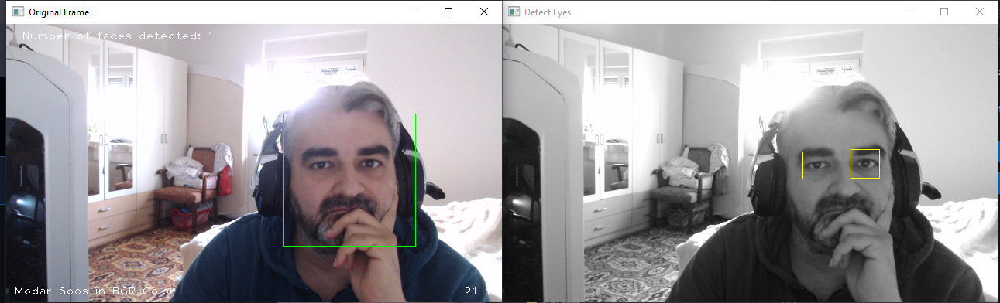

# تطبيق كاميرا الوجه باستخدام OpenCV



## الإصدار 1.0.0 - إصدار "معرفة الوجه"

نحن متحمسون لتقديم إصدارنا الأول من تطبيق كاميرا الوجه باستخدام تقنيات OpenCV، والذي يحمل الإصدار 1.0.0 - إصدار "معرفة الوجه". يهدف هذا التطبيق إلى تحديد الوجوه والعيون في الفيديو الملتقط من الكاميرا وتسليط الضوء على هذه الميزات.

## الميزات الرئيسية

**كشف الوجوه بسهولة:** يتيح لك التطبيق رؤية عدد الوجوه المكتشفة في الفيديو وتحديدها بإطارات.

**كشف العيون:** بالإضافة إلى الوجوه، يتعقب التطبيق العيون في الوجوه المكتشفة ويميزها بلون مميز.

**معلومات الأداء:** يعرض التطبيق معلومات الأداء مثل عدد الوجوه المكتشفة ومعدل الإطارات في الثانية (FPS).

## كيفية تشغيل المشروع

1. قم بتثبيت مكتبة OpenCV باستخدام الأمر التالي:
```
pip install opencv-python

```
استبدل مسارات ملفات المصنفات (haarcascade_frontalface_default.xml، haarcascade_eye.xml، haarcascade_frontalcatface_extended.xml) بالمسارات الخاصة بك.

2. قم بتشغيل البرنامج باستخدام Python:

```
python your_project_file.py

```
